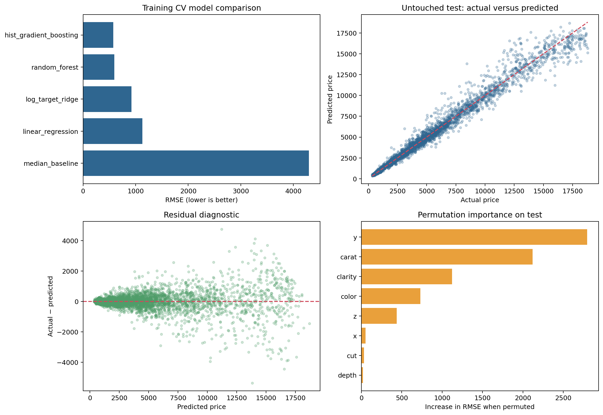
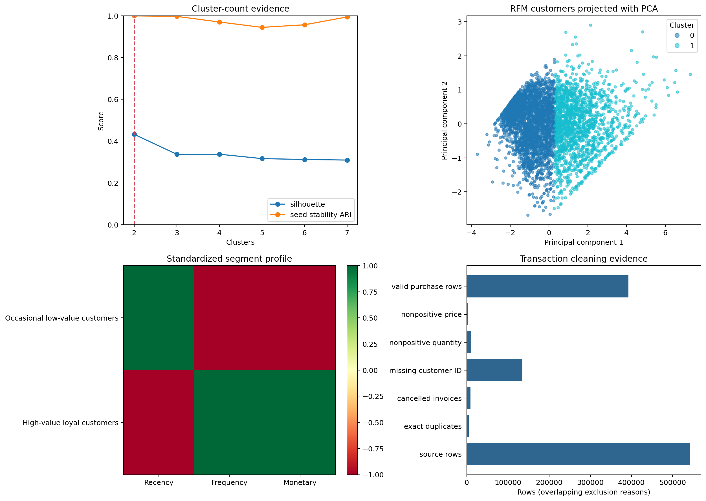

# Applied Data Science Portfolio — Rebuilt

    

A recruiter-facing portfolio of 13 end-to-end statistics, data science, machine learning, forecasting, NLP, retail, biomedical, and customer-analytics case studies.

This rebuild preserves the analytical intent of the original classroom projects while replacing assignment-style execution with a consistent professional standard:

> **Business problem → data provenance → quality audit → EDA → hypotheses → feature engineering → baseline → candidate models → validation → explainability → business decision → limitations**

## Technical profile

I build reproducible analytical systems that connect rigorous methodology with stakeholder decisions. The portfolio demonstrates mixed-type ML pipelines, cross-validation, calibration, threshold analysis, grouped patient evaluation, chronological forecasting, statistical robustness, text analytics, clustering stability, artifact testing, and responsible interpretation.

## Start with executed evidence

[Execution and environment report](REPRODUCIBILITY_REPORT.md) · [Portfolio audit](PORTFOLIO_AUDIT.md) · [Model results](MODEL_RESULTS_SUMMARY.md) · [Status matrix](PROJECT_STATUS_MATRIX.md) · [Run instructions](RUN_INSTRUCTIONS.md)

| Insurance classification | Gem-price regression |
|---|---|
| [](projects/04-insurance-claim-prediction/notebooks/01_end_to_end_analysis.ipynb) | [](projects/05-gem-price-regression/notebooks/01_end_to_end_analysis.ipynb) |

| Wine forecasting | Online Retail segmentation |
|---|---|
| [](projects/09-wine-sales-forecasting/notebooks/01_end_to_end_analysis.ipynb) | [](projects/12-online-retail-segmentation/notebooks/01_end_to_end_analysis.ipynb) |

## Verified project portfolio

| No. | Project | Problem type | Dataset | Best verified result | Decision value |
|---:|---|---|---|---|---|
| 1 | [Statistical Methods for Decision-Making](projects/01-statistical-methods/) | Statistical inference | 440 wholesale customers, 62 survey respondents, and 36 shingle rows across three CSV files. | Shingle B is below the 0.35 limit by both t and Wilcoxon tests (t-test p=0.0021); Shingle A is not below the limit by the prespecified t-test (p=0.075). | Prioritize category/channel investigation and decide whether moisture evidence supports a specification claim. |
| 2 | [Uber Drive Behavior and Productivity Analysis](projects/02-uber-drive-analysis/) | Decision-oriented exploratory analysis | 1,155 source rows containing trip timestamps, categories, locations, distance, and purpose. | After mixed-format date repair, 1,154 valid trips total 12,194.8 miles; 94.1% of recorded mileage is categorized as business. | Improve purpose capture, route scheduling, mileage review, and reimbursement evidence. |
| 3 | [Salary Factor Analysis and College Admissions PCA](projects/03-anova-pca-analysis/) | Factorial inference and dimensionality reduction | 40 salary observations and 777 colleges with 17 numeric admissions and institutional indicators. | Education shows a large observed salary association (eta²=0.626); 6 standardized components retain at least 80% of college-indicator variance. | Identify material group differences and select a defensible reduced indicator set. |
| 4 | [Insurance Claim Propensity Modeling](projects/04-insurance-claim-prediction/) | Imbalanced binary classification | 3,000 policy rows with demographic, agency, product, destination, duration, sales, commission, channel, and claim fields. | The tuned random forest selected by training PR-AUC reaches untouched-test ROC-AUC 0.800, PR-AUC 0.618, and balanced accuracy 0.709. | Understand ranking and threshold trade-offs while keeping claim decisions under human governance. |
| 5 | [Cubic Zirconia Price Modeling](projects/05-gem-price-regression/) | Supervised regression | 26,967 cubic-zirconia records with physical measurements, quality grades, and price. | Histogram gradient boosting reaches untouched-test R² 0.981, RMSE 562, and 90.7% coverage for the training-calibrated 90% diagnostic interval. | Estimate price ranges and identify where prediction errors become operationally material. |
| 6 | [Holiday Package Purchase Propensity](projects/06-holiday-package-prediction/) | Binary propensity modeling | 872 records with purchase outcome, salary, age, education, children, and foreign-status fields. | Calibrated logistic regression reaches untouched-test ROC-AUC 0.730 and PR-AUC 0.707; the high-recall training threshold produces 93.0% recall with low specificity. | Choose contact thresholds consistent with capacity and false-positive/false-negative costs. |
| 7 | [Retrospective Election Survey Classification](projects/07-election-exit-poll-prediction/) | Historical binary classification | 1,525 historical survey rows with vote, age, leader ratings, economic assessments, Europe attitudes, knowledge, and gender. | The calibrated random forest reaches retrospective test ROC-AUC 0.907 and balanced accuracy 0.800; this is respondent classification, not polling. | Understand classification signal and uncertainty without making live-election claims. |
| 8 | [U.S. Presidential Inaugural Speech Analysis](projects/08-presidential-speech-analysis/) | Small-corpus exploratory NLP | The 1941 Roosevelt, 1961 Kennedy, and 1973 Nixon inaugural addresses stored as three workbooks. | Kennedy 1961 and Nixon 1973 are the most similar tested pair by unigram/bigram TF-IDF cosine similarity (0.114), while topic and readability outputs remain exploratory. | Locate lexical differences for closer human reading rather than automate historical judgment. |
| 9 | [Wine Sales Forecasting with Rolling-Origin Validation](projects/09-wine-sales-forecasting/) | Monthly time-series forecasting | 187 monthly Rose and Sparkling observations from January 1980 through July 1995. | Rolling-origin selection chooses trend plus month for Rose (holdout RMSE 13.6) and additive Holt-Winters for Sparkling (RMSE 358.7). | Choose a reproducible baseline and quantify forecast risk before inventory commitment. |
| 10 | [Cafe Marketing and Retail Analytics](projects/10-marketing-retail-analysis/) | Transactional business analysis and item segmentation | 145,830 cafe line items covering 69,982 bills and one year of activity. | The cleaned year contains 69,982 bills and 32,654,640 recorded revenue units; two stable menu-item groups score 0.395 silhouette. | Prioritize menu review, daypart staffing, and carefully tested cross-sell ideas. |
| 11 | [Participant-Safe Parkinson's Voice Classification](projects/11-parkinsons-disease-detection/) | Grouped high-stakes classification | 195 recordings, 22 acoustic features, and 32 derived participant identifiers. | With no participant overlap, the eight-person holdout has balanced accuracy 0.750, sensitivity 1.000, and specificity 0.500; uncertainty is necessarily wide. | Judge whether signal warrants external study—not make a clinical decision. |
| 12 | [Online Retail Customer Segmentation](projects/12-online-retail-segmentation/) | Unsupervised RFM segmentation | 541,909 UCI Online Retail transaction rows from December 2010 through December 2011. | The pipeline segments 4,338 customers into 2 stable RFM groups (silhouette 0.432, seed ARI 0.999). | Design differentiated retention and reactivation experiments without sensitive profiling. |
| 13 | [Historical COVID-19 Next-Day Case Modeling](projects/13-covid-outbreak-prediction/) | Historical panel forecasting | 19,496 country-date rows from December 2019 through May 2020 with cases, tests, policy, population, and demographic fields. | Across rolling origins, the seven-day rolling baseline remains best; final historical holdout RMSE is 388.2 with 89.6% diagnostic interval coverage. | Assess baseline adequacy and reporting risk—not make a current forecast or policy recommendation. |

## Portfolio philosophy

- A simple baseline that survives validation is more valuable than a complicated model selected on the test set.
- Preprocessing belongs inside training folds.
- Repeated entities and time require grouped and chronological validation.
- Calibration, error segments, interval coverage, stability, and assumptions matter alongside headline metrics.
- Clusters are descriptive profiles, not objective truths.
- Medical, political, insurance, and public-health analyses require especially clear boundaries.
- Modest or negative results are retained when they are methodologically correct.

## Repository architecture

```text
applied-data-science-portfolio-rebuilt/
├── README.md
├── PORTFOLIO_AUDIT.md
├── PROJECT_STATUS_MATRIX.md
├── MODEL_RESULTS_SUMMARY.md
├── REPRODUCIBILITY_REPORT.md
├── RUN_INSTRUCTIONS.md
├── setup.ps1 / run_all.ps1 / setup_and_run.ps1
├── run_all.py / validate_portfolio.py
├── portfolio_lib/                 # shared tested utilities
├── projects/                      # 13 complete case studies
├── scripts/                       # notebook and documentation builders
└── tests/                         # schema, path, notebook, and contract tests
```

Each project contains a long-form executed notebook, reusable source implementation, professional README, one-page project summary, data provenance note and checksums, machine-readable metrics, saved tables, figures, and a fitted model where retaining one adds value.

## Unified installation and execution

### Windows — recommended

```powershell
powershell -ExecutionPolicy Bypass -File .\setup_and_run.ps1
```

### Manual Python 3.12 setup

```powershell
py -3.12 -m venv .venv
.\.venv\Scripts\python.exe -m pip install --upgrade pip
.\.venv\Scripts\python.exe -m pip install -e ".[notebooks,dev]"
.\.venv\Scripts\python.exe run_all.py
```

Python 3.13 is supported where the bounded dependencies provide wheels; replace `-3.12` with `-3.13`. CPU execution is the default and no API key or GPU is required.

## Skills matrix

| Skill | Projects |
|---|---|
| Statistical assumptions, robust alternatives, effect size | 1, 3 |
| Decision-oriented EDA and data quality | 1–13 |
| Leakage-safe mixed-type pipelines | 4–7 |
| Calibration and threshold analysis | 4, 6, 7 |
| Regression diagnostics and uncertainty | 5 |
| Grouped participant validation | 11 |
| Rolling-origin chronological validation | 9, 13 |
| NLP, readability, TF-IDF, topics | 8 |
| Basket analysis and retail operations | 10 |
| RFM, multi-method clustering, stability | 12 |
| Explainability and error segmentation | 4–7, 11, 13 |
| Reproducible notebooks, artifacts, tests | All |

## Reproducibility statement

All displayed numerical claims are read from executed `reports/metrics.json` files. The primary notebooks were executed from top to bottom and retain execution counts and outputs. Dataset hashes, metric hashes, package versions, measured runtime, and notebook status are recorded in `REPRODUCIBILITY_REPORT.md` and `.json`.

## Portfolio-wide limitations

Several classroom datasets lack complete sampling or redistribution documentation. Historical samples do not establish current performance. Holdout results remain estimates, not deployment guarantees. No project should be used as an automatic medical, political, financial, insurance, or public-health decision system.

## Author

[Anmol Tripathi on GitHub](https://github.com/unit-mole)
