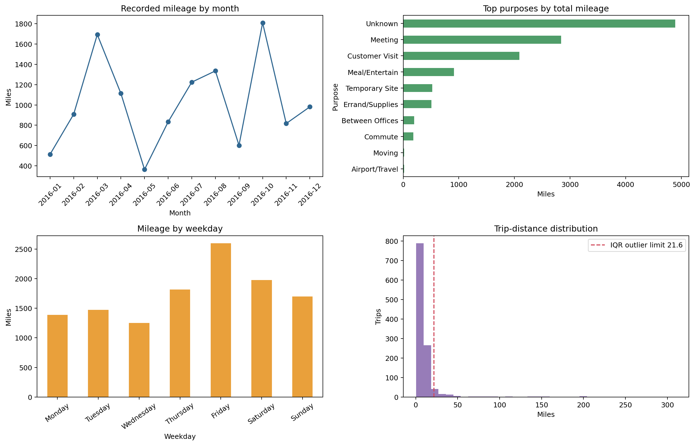

# Uber Drive Behavior and Productivity Analysis

[](https://www.python.org/)
[](https://pandas.pydata.org/)
[](https://scikit-learn.org/)
[](notebooks/01_end_to_end_analysis.ipynb)
[](../../REPRODUCIBILITY_REPORT.md)
[](../../LICENSE)

> **Value proposition:** Audit and summarize a personal trip log to expose temporal, purpose, route, and distance patterns without inventing a prediction target.


---

## Project Overview

**Business question.** Audit and summarize a personal trip log to expose temporal, purpose, route, and distance patterns without inventing a prediction target.  
**Dataset.** 1,155 source rows containing trip timestamps, categories, locations, distance, and purpose.  
**Verified result.** After mixed-format date repair, 1,154 valid trips total 12,194.8 miles; 94.1% of recorded mileage is categorized as business.  
**Decision value.** Improve purpose capture, route scheduling, mileage review, and reimbursement evidence.  
**Primary limitation.** This is one personal log over a limited period; location and purpose data are sensitive and findings do not generalize to platform-wide demand.



[Open the executed notebook](notebooks/01_end_to_end_analysis.ipynb) · [Inspect source code](src/analysis.py) · [Inspect metrics](reports/metrics.json) · [Original project](<https://github.com/unit-mole/Python-for-Data-Science-on-Uber-Drive->)

---

## Responsible Use

This is one personal log over a limited period; location and purpose data are sensitive and findings do not generalize to platform-wide demand.

Treat outputs as educational analytical evidence and require domain review before operational use.

This project is intended for education, analytical demonstration, and portfolio presentation. Its outputs should be reviewed by qualified domain experts before they influence operational, financial, medical, quality, or other consequential decisions.

---

## Business Problem

The intended user is **A traveler, fleet analyst, or expense-process owner**. The analysis supports this decision: **Improve purpose capture, route scheduling, mileage review, and reimbursement evidence.** It does not claim causality or production readiness unless the study design supports that claim.

---

## Project Objective

1. What data-quality issues materially affect the analysis?
2. Which baseline establishes the minimum useful performance or descriptive reference?
3. Which method is selected under a leakage-safe validation design?
4. How stable, calibrated, or assumption-sensitive is the result?
5. What action is supported, and what action remains outside scope?

Technical success requires a fully executed pipeline, correct split logic, task-appropriate metrics, saved evidence, deterministic seeds where supported, and zero notebook errors. Business success requires an interpretable result that changes a defensible analytical decision without fabricating financial impact.

---

## Project Pattern

This project follows a reproducible applied-data-science pattern:

1. establish dataset provenance and data-quality constraints;
2. define the analytical question and minimum useful baseline;
3. select a validation strategy that respects the unit of observation;
4. compare justified statistical or machine-learning methods;
5. preserve results, diagnostics, and reproducibility evidence;
6. translate the findings into a bounded business recommendation;
7. document limitations, licensing, and responsible-use conditions.

---

## Dataset

1,155 source rows containing trip timestamps, categories, locations, distance, and purpose.

The dataset is bundled in the original repository; upstream collection context and reuse terms are not documented.

The exact local files, row counts, data types, missingness, cardinality, and checksums are exposed in the notebook and `reports/tables/*data_quality.csv`. Dataset terms must be reviewed separately from the repository's MIT code license.

---

## Tools and Technologies

Python 3.12/3.13 · pandas · NumPy · SciPy · scikit-learn · Matplotlib · OpenPyXL · Jupyter · data-quality engineering · Decision-oriented exploratory analysis · reproducibility · responsible interpretation.

---

## End-to-End Project Workflow

Mixed-format datetime repair, data-quality rules, duration and speed checks, temporal aggregation, route concentration, missing-purpose analysis, and IQR outlier review.

Reusable logic lives in `src/analysis.py`; the notebook imports and executes that same implementation. Preprocessing is fitted only inside training folds where a supervised model is used. Grouped and chronological projects keep entity and time boundaries intact.

---

## Model and Analytical Results

> After mixed-format date repair, 1,154 valid trips total 12,194.8 miles; 94.1% of recorded mileage is categorized as business.

### Primary comparison table

| month | trips | miles | median_miles |
|---|---|---|---|
| 2016-01 | 61 | 512.900 | 5.500 |
| 2016-02 | 115 | 908.200 | 6.100 |
| 2016-03 | 113 | 1693.900 | 6.600 |
| 2016-04 | 54 | 1113.000 | 8.800 |
| 2016-05 | 49 | 363.800 | 6.100 |
| 2016-06 | 107 | 832.900 | 7.200 |
| 2016-07 | 112 | 1224.600 | 7.100 |
| 2016-08 | 133 | 1335.500 | 5.700 |
| 2016-09 | 36 | 601.800 | 9.700 |
| 2016-10 | 106 | 1810.000 | 8.350 |

All values above are generated from the committed data and synchronized with `reports/metrics.json` after execution.

---

## Evaluation, Explainability, and Robustness

- The project saves its comparison and diagnostic tables under `reports/tables/`.
- The primary figure combines model/statistical evidence with error, stability, calibration, or profile evidence appropriate to the task.
- Predictive projects compare against a baseline and preserve an untouched holdout.
- Statistical projects report assumptions, effect size, and robust alternatives.
- Clustering projects report internal metrics as descriptive evidence—not proof of objectively real groups.
- Time-series projects use chronological origins and transparent baselines.

---

## Business Recommendations

| Priority | Recommendation | Evidence | Expected benefit | Risk or limitation | How to measure success |
|---:|---|---|---|---|---|
| 1 | Use the verified result to prioritize a controlled analytical follow-up. | After mixed-format date repair, 1,154 valid trips total 12,194.8 miles; 94.1% of recorded mileage is categorized as business. | Better evidence for the stated decision | Observational or historical data may not generalize | Re-run on current data with a prespecified metric |
| 2 | Review the largest error, uncertainty, or sensitivity segment before deployment. | See saved diagnostic tables | Reduces hidden failure risk | Small subgroups can produce unstable estimates | Track subgroup error and interval coverage |
| 3 | Keep a transparent baseline in future monitoring. | Baseline comparison is recorded in the notebook | Detects when complexity stops adding value | Baselines do not capture every business driver | Compare every refresh against the same baseline |

---

## Model and Evaluation Artifacts

The committed project preserves its analytical evidence through:

- the fully executed notebook under `notebooks/`;
- reusable analytical logic under `src/`;
- synchronized metrics in `reports/metrics.json`;
- comparison and diagnostic tables under `reports/tables/`;
- recruiter-facing figures under `reports/figures/`;
- fitted artifacts under `models/` when a saved model is appropriate;
- project-level provenance documentation under `data/README.md`.

---

## Run the Project Locally

From the portfolio root:

```bash
python projects/02-uber-drive-analysis/src/analysis.py
python scripts/execute_notebooks.py --project 02-uber-drive-analysis
python validate_portfolio.py
```

Expected project runtime is hardware-dependent; the root reproducibility report records the measured portfolio run. Outputs are written under `projects/02-uber-drive-analysis/reports/` and, for selected predictive models, `projects/02-uber-drive-analysis/models/`.

---

## Project Structure

```text
02-uber-drive-analysis/
├── data/README.md
├── notebooks/01_end_to_end_analysis.ipynb
├── src/analysis.py
├── reports/figures/
├── reports/tables/
├── reports/metrics.json
├── models/                 # when a fitted artifact is useful
├── PROJECT_SUMMARY.md
└── README.md
```

---

## Limitations

This is one personal log over a limited period; location and purpose data are sensitive and findings do not generalize to platform-wide demand.

Treat outputs as educational analytical evidence and require domain review before operational use.

---

## Future Improvements

Acquire current, licensed, externally representative data; pre-register the primary metric and validation design; add domain-reviewed cost assumptions; and test the final approach prospectively before any operational use.

---

## Skills Demonstrated

Python 3.12/3.13 · pandas · NumPy · SciPy · scikit-learn · Matplotlib · OpenPyXL · Jupyter · data-quality engineering · Decision-oriented exploratory analysis · reproducibility · responsible interpretation.

---

## Portfolio Positioning

I rebuilt this as a decision-oriented exploratory analysis case study. I began with provenance and data-quality risks, defined a baseline and validation design appropriate to the unit of observation, compared only justified methods, and accepted the result shown above even where a simpler baseline won. I then connected diagnostics and uncertainty to a specific stakeholder decision and documented where the evidence must not be used.

---

## Data and Third-Party Materials

The original source code and original documentation created for this project are licensed under the portfolio's [MIT License](../../LICENSE).

The datasets, pretrained models, model weights, images, reference materials, and other third-party assets used by this project are **not** relicensed under the MIT License. They remain subject to the licenses, source terms, attribution requirements, and usage restrictions established by their respective owners.

Dataset provenance and known reuse limitations are documented in the [project data documentation](data/README.md) and in the Dataset section above. Where the upstream collection process or redistribution terms are undocumented, users must not assume that the material is cleared for unrestricted reuse. Review the original provider's terms before copying, redistributing, or using any third-party material outside this portfolio.

Unless explicitly stated otherwise, trained models, analytical outputs, reports, and generated artifacts are provided for educational, research, and portfolio-demonstration purposes. They are not guaranteed to be suitable for production, medical, financial, safety-critical, or other high-risk applications.

---

## Author

**Anmol Tripathi**  
Quality Data Scientist | Data Science | Machine Learning | Applied AI | Statistical Analysis | Predictive Analytics | Analytics Engineering | Quality Analytics
