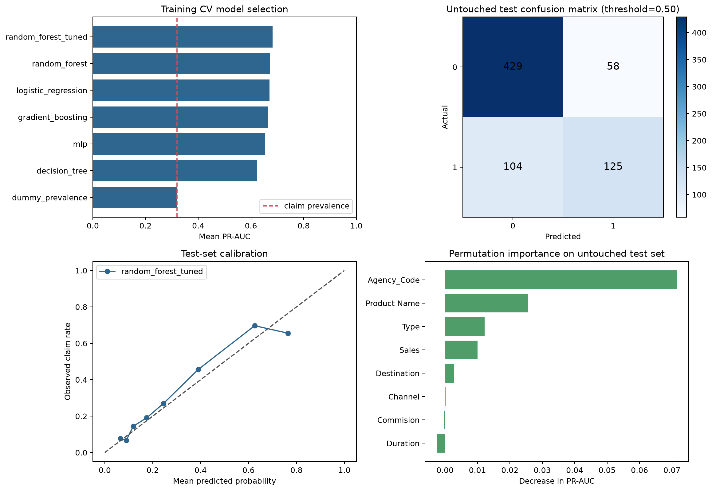

# Insurance Claim Propensity Modeling

> **Value proposition:** Compare and calibrate claim-propensity models using training-only selection and an untouched test set.

  

## Executive summary

**Business question.** Compare and calibrate claim-propensity models using training-only selection and an untouched test set.  
**Dataset.** 3,000 policy rows with demographic, agency, product, destination, duration, sales, commission, channel, and claim fields.  
**Verified result.** The tuned random forest selected by training PR-AUC reaches untouched-test ROC-AUC 0.799, PR-AUC 0.613, and balanced accuracy 0.713.  
**Decision value.** Understand ranking and threshold trade-offs while keeping claim decisions under human governance.  
**Primary limitation.** Educational model only; never use it to approve, deny, price, or investigate an insurance claim.



[Open the executed notebook](notebooks/01_end_to_end_analysis.ipynb) · [Inspect source code](src/analysis.py) · [Inspect metrics](reports/metrics.json) · [Original project](<https://github.com/unit-mole/Claim-Status-of-Insurance-firm-using-CART-RF-ANN>)

## Business problem

The intended user is **An insurance analytics or operations team**. The analysis supports this decision: **Understand ranking and threshold trade-offs while keeping claim decisions under human governance.** It does not claim causality or production readiness unless the study design supports that claim.

## Analytical questions and success criteria

1. What data-quality issues materially affect the analysis?
2. Which baseline establishes the minimum useful performance or descriptive reference?
3. Which method is selected under a leakage-safe validation design?
4. How stable, calibrated, or assumption-sensitive is the result?
5. What action is supported, and what action remains outside scope?

Technical success requires a fully executed pipeline, correct split logic, task-appropriate metrics, saved evidence, deterministic seeds where supported, and zero notebook errors. Business success requires an interpretable result that changes a defensible analytical decision without fabricating financial impact.

## Dataset and provenance

3,000 policy rows with demographic, agency, product, destination, duration, sales, commission, channel, and claim fields.

Bundled in the original repository; the upstream sampling frame, collection process, and redistribution terms are not documented.

The exact local files, row counts, data types, missingness, cardinality, and checksums are exposed in the notebook and `reports/tables/*data_quality.csv`. Dataset terms must be reviewed separately from the repository's MIT code license.

## Methodology

Duplicate leakage control, mixed-type pipelines, dummy baseline, logistic/CART/random-forest/boosting/MLP comparison, randomized tuning, stratified CV, calibration, threshold selection, PR-AUC, and permutation importance.

Reusable logic lives in `src/analysis.py`; the notebook imports and executes that same implementation. Preprocessing is fitted only inside training folds where a supervised model is used. Grouped and chronological projects keep entity and time boundaries intact.

## Validation strategy

```json
{
  "train_rows": 2145,
  "untouched_test_rows": 716,
  "test_fraction": 0.25,
  "selection_cv": "4-fold stratified CV on training data only",
  "optimization_metric": "average precision (PR-AUC)",
  "random_seed": 42
}
```

## Verified result

> The tuned random forest selected by training PR-AUC reaches untouched-test ROC-AUC 0.799, PR-AUC 0.613, and balanced accuracy 0.713.

### Primary comparison table

| model | cv_pr_auc_mean | cv_pr_auc_std | cv_roc_auc_mean | cv_balanced_accuracy_mean | selection_stage |
|---|---|---|---|---|---|
| random_forest_tuned | 0.682 |  |  |  | randomized_search_8_candidates |
| random_forest | 0.673 | 0.037 | 0.812 | 0.744 | candidate |
| logistic_regression | 0.671 | 0.058 | 0.810 | 0.744 | candidate |
| gradient_boosting | 0.663 | 0.049 | 0.808 | 0.699 | candidate |
| mlp | 0.654 | 0.079 | 0.785 | 0.680 | candidate |
| decision_tree | 0.624 | 0.051 | 0.793 | 0.721 | candidate |
| dummy_prevalence | 0.319 | 0.001 | 0.500 | 0.500 | candidate |

All values above are generated from the committed data and synchronized with `reports/metrics.json` after execution.

## Explainability, diagnostics, and robustness

- The project saves its comparison and diagnostic tables under `reports/tables/`.
- The primary figure combines model/statistical evidence with error, stability, calibration, or profile evidence appropriate to the task.
- Predictive projects compare against a baseline and preserve an untouched holdout.
- Statistical projects report assumptions, effect size, and robust alternatives.
- Clustering projects report internal metrics as descriptive evidence—not proof of objectively real groups.
- Time-series projects use chronological origins and transparent baselines.

## Business recommendations

| Priority | Recommendation | Evidence | Expected benefit | Risk or limitation | How to measure success |
|---:|---|---|---|---|---|
| 1 | Use the verified result to prioritize a controlled analytical follow-up. | The tuned random forest selected by training PR-AUC reaches untouched-test ROC-AUC 0.799, PR-AUC 0.613, and balanced accuracy 0.713. | Better evidence for the stated decision | Observational or historical data may not generalize | Re-run on current data with a prespecified metric |
| 2 | Review the largest error, uncertainty, or sensitivity segment before deployment. | See saved diagnostic tables | Reduces hidden failure risk | Small subgroups can produce unstable estimates | Track subgroup error and interval coverage |
| 3 | Keep a transparent baseline in future monitoring. | Baseline comparison is recorded in the notebook | Detects when complexity stops adding value | Baselines do not capture every business driver | Compare every refresh against the same baseline |

## Limitations and responsible use

See the executed metrics for project-specific limitations.

Educational model only; never use it to approve, deny, price, or investigate an insurance claim.

## Repository structure

```text
04-insurance-claim-prediction/
├── data/README.md
├── notebooks/01_end_to_end_analysis.ipynb
├── src/analysis.py
├── reports/figures/
├── reports/tables/
├── reports/metrics.json
├── models/                 # when a fitted artifact is useful
├── PROJECT_SUMMARY.md
└── README.md
```

## Run locally

From the portfolio root:

```bash
python projects/04-insurance-claim-prediction/src/analysis.py
python scripts/execute_notebooks.py --project 04-insurance-claim-prediction
python validate_portfolio.py
```

Expected project runtime is hardware-dependent; the root reproducibility report records the measured portfolio run. Outputs are written under `projects/04-insurance-claim-prediction/reports/` and, for selected predictive models, `projects/04-insurance-claim-prediction/models/`.

## Technologies and skills demonstrated

Python 3.12/3.13 · pandas · NumPy · SciPy · scikit-learn · Matplotlib · OpenPyXL · Jupyter · data-quality engineering · Imbalanced binary classification · reproducibility · responsible interpretation.

## Future work

Acquire current, licensed, externally representative data; pre-register the primary metric and validation design; add domain-reviewed cost assumptions; and test the final approach prospectively before any operational use.

## Interview-ready explanation

“I rebuilt this as a imbalanced binary classification case study. I began with provenance and data-quality risks, defined a baseline and validation design appropriate to the unit of observation, compared only justified methods, and accepted the result shown above even where a simpler baseline won. I then connected diagnostics and uncertainty to a specific stakeholder decision and documented where the evidence must not be used.”

## Résumé bullets

- Re-engineered a travel insurance analysis into a reproducible imbalanced binary classification workflow with automated data-quality evidence, saved outputs, and a fully executed recruiter-facing notebook.
- Implemented duplicate leakage control and problem-appropriate validation to produce the verified result: The tuned random forest selected by training PR-AUC reaches untouched-test ROC-AUC 0.799, PR-AUC 0.613, and balanced accuracy 0.713.
- Translated model/statistical diagnostics into prioritized recommendations while documenting provenance, uncertainty, and responsible-use limits.
