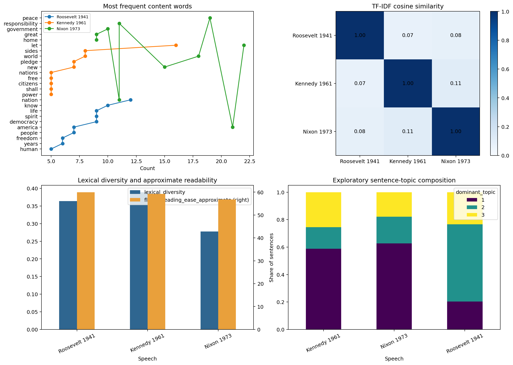

# U.S. Presidential Inaugural Speech Analysis

> **Value proposition:** Compare lexical structure, readability, distinctive terms, similarity, and exploratory topics across three inaugural speeches.

  

## Executive summary

**Business question.** Compare lexical structure, readability, distinctive terms, similarity, and exploratory topics across three inaugural speeches.  
**Dataset.** The 1941 Roosevelt, 1961 Kennedy, and 1973 Nixon inaugural addresses stored as three workbooks.  
**Verified result.** Kennedy 1961 and Nixon 1973 are the most similar tested pair by unigram/bigram TF-IDF cosine similarity (0.114), while topic and readability outputs remain exploratory.  
**Decision value.** Locate lexical differences for closer human reading rather than automate historical judgment.  
**Primary limitation.** Lexical counts, similarity, readability, and topics do not establish ideology, truthfulness, policy effect, or speaker intent.



[Open the executed notebook](notebooks/01_end_to_end_analysis.ipynb) · [Inspect source code](src/analysis.py) · [Inspect metrics](reports/metrics.json) · [Original project](<https://github.com/unit-mole/U.S.A_Presidential_Speech_Analysis_using_Machine_Learning>)

## Business problem

The intended user is **A digital-humanities or communications analyst**. The analysis supports this decision: **Locate lexical differences for closer human reading rather than automate historical judgment.** It does not claim causality or production readiness unless the study design supports that claim.

## Analytical questions and success criteria

1. What data-quality issues materially affect the analysis?
2. Which baseline establishes the minimum useful performance or descriptive reference?
3. Which method is selected under a leakage-safe validation design?
4. How stable, calibrated, or assumption-sensitive is the result?
5. What action is supported, and what action remains outside scope?

Technical success requires a fully executed pipeline, correct split logic, task-appropriate metrics, saved evidence, deterministic seeds where supported, and zero notebook errors. Business success requires an interpretable result that changes a defensible analytical decision without fabricating financial impact.

## Dataset and provenance

The 1941 Roosevelt, 1961 Kennedy, and 1973 Nixon inaugural addresses stored as three workbooks.

The original project identifies NLTK's inaugural corpus as the source; local workbooks preserve imported snapshots.

The exact local files, row counts, data types, missingness, cardinality, and checksums are exposed in the notebook and `reports/tables/*data_quality.csv`. Dataset terms must be reviewed separately from the repository's MIT code license.

## Methodology

Corpus-quality audit, tokenization, lexical diversity, approximate Flesch readability, unigram/bigram TF-IDF, cosine similarity, distinctive-term analysis, and sentence-level NMF topics.

Reusable logic lives in `src/analysis.py`; the notebook imports and executes that same implementation. Preprocessing is fitted only inside training folds where a supervised model is used. Grouped and chronological projects keep entity and time boundaries intact.

## Validation strategy

```json
{}
```

## Verified result

> Kennedy 1961 and Nixon 1973 are the most similar tested pair by unigram/bigram TF-IDF cosine similarity (0.114), while topic and readability outputs remain exploratory.

### Primary comparison table

| document | term | tfidf |
|---|---|---|
| Roosevelt 1941 | democracy | 0.099 |
| Roosevelt 1941 | body | 0.081 |
| Roosevelt 1941 | speaks | 0.081 |
| Roosevelt 1941 | mind | 0.081 |
| Roosevelt 1941 | know | 0.078 |
| Roosevelt 1941 | spirit | 0.075 |
| Roosevelt 1941 | years | 0.066 |
| Roosevelt 1941 | like person | 0.065 |
| Roosevelt 1941 | spirit faith | 0.065 |
| Roosevelt 1941 | task | 0.065 |

All values above are generated from the committed data and synchronized with `reports/metrics.json` after execution.

## Explainability, diagnostics, and robustness

- The project saves its comparison and diagnostic tables under `reports/tables/`.
- The primary figure combines model/statistical evidence with error, stability, calibration, or profile evidence appropriate to the task.
- Predictive projects compare against a baseline and preserve an untouched holdout.
- Statistical projects report assumptions, effect size, and robust alternatives.
- Clustering projects report internal metrics as descriptive evidence—not proof of objectively real groups.
- Time-series projects use chronological origins and transparent baselines.

## Business recommendations

| Priority | Recommendation | Evidence | Expected benefit | Risk or limitation | How to measure success |
|---:|---|---|---|---|---|
| 1 | Use the verified result to prioritize a controlled analytical follow-up. | Kennedy 1961 and Nixon 1973 are the most similar tested pair by unigram/bigram TF-IDF cosine similarity (0.114), while topic and readability outputs remain exploratory. | Better evidence for the stated decision | Observational or historical data may not generalize | Re-run on current data with a prespecified metric |
| 2 | Review the largest error, uncertainty, or sensitivity segment before deployment. | See saved diagnostic tables | Reduces hidden failure risk | Small subgroups can produce unstable estimates | Track subgroup error and interval coverage |
| 3 | Keep a transparent baseline in future monitoring. | Baseline comparison is recorded in the notebook | Detects when complexity stops adding value | Baselines do not capture every business driver | Compare every refresh against the same baseline |

## Limitations and responsible use

See the executed metrics for project-specific limitations.

Lexical counts, similarity, readability, and topics do not establish ideology, truthfulness, policy effect, or speaker intent.

## Repository structure

```text
08-presidential-speech-analysis/
├── data/README.md
├── notebooks/01_end_to_end_analysis.ipynb
├── src/analysis.py
├── reports/figures/
├── reports/tables/
├── reports/metrics.json
├── models/                 # when a fitted artifact is useful
├── PROJECT_SUMMARY.md
└── README.md
```

## Run locally

From the portfolio root:

```bash
python projects/08-presidential-speech-analysis/src/analysis.py
python scripts/execute_notebooks.py --project 08-presidential-speech-analysis
python validate_portfolio.py
```

Expected project runtime is hardware-dependent; the root reproducibility report records the measured portfolio run. Outputs are written under `projects/08-presidential-speech-analysis/reports/` and, for selected predictive models, `projects/08-presidential-speech-analysis/models/`.

## Technologies and skills demonstrated

Python 3.12/3.13 · pandas · NumPy · SciPy · scikit-learn · Matplotlib · OpenPyXL · Jupyter · data-quality engineering · Small-corpus exploratory NLP · reproducibility · responsible interpretation.

## Future work

Acquire current, licensed, externally representative data; pre-register the primary metric and validation design; add domain-reviewed cost assumptions; and test the final approach prospectively before any operational use.

## Interview-ready explanation

“I rebuilt this as a small-corpus exploratory nlp case study. I began with provenance and data-quality risks, defined a baseline and validation design appropriate to the unit of observation, compared only justified methods, and accepted the result shown above even where a simpler baseline won. I then connected diagnostics and uncertainty to a specific stakeholder decision and documented where the evidence must not be used.”

## Résumé bullets

- Re-engineered a natural language processing and political text analysis into a reproducible small-corpus exploratory nlp workflow with automated data-quality evidence, saved outputs, and a fully executed recruiter-facing notebook.
- Implemented corpus-quality audit and problem-appropriate validation to produce the verified result: Kennedy 1961 and Nixon 1973 are the most similar tested pair by unigram/bigram TF-IDF cosine similarity (0.114), while topic and readability outputs remain exploratory.
- Translated model/statistical diagnostics into prioritized recommendations while documenting provenance, uncertainty, and responsible-use limits.
