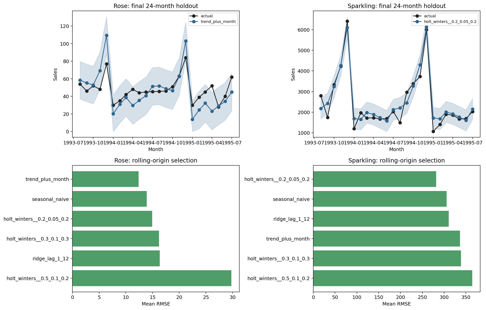

# Wine Sales Forecasting with Rolling-Origin Validation

> **Value proposition:** Select transparent monthly forecasting methods on multiple historical origins and evaluate once on a final 24-month holdout.

  

## Executive summary

**Business question.** Select transparent monthly forecasting methods on multiple historical origins and evaluate once on a final 24-month holdout.  
**Dataset.** 187 monthly Rose and Sparkling observations from January 1980 through July 1995.  
**Verified result.** Rolling-origin selection chooses trend plus month for Rose (holdout RMSE 13.6) and additive Holt-Winters for Sparkling (RMSE 358.7).  
**Decision value.** Choose a reproducible baseline and quantify forecast risk before inventory commitment.  
**Primary limitation.** The series ends in 1995 and lacks price, promotion, inventory, weather, and economic drivers; diagnostic intervals are empirical validation-error bands rather than formal probabilistic intervals.



[Open the executed notebook](notebooks/01_end_to_end_analysis.ipynb) · [Inspect source code](src/analysis.py) · [Inspect metrics](reports/metrics.json) · [Original project](<https://github.com/unit-mole/Forecasting_Wine_Sales_for_ABC_Estate_Wines_company>)

## Business problem

The intended user is **An inventory or demand-planning analyst**. The analysis supports this decision: **Choose a reproducible baseline and quantify forecast risk before inventory commitment.** It does not claim causality or production readiness unless the study design supports that claim.

## Analytical questions and success criteria

1. What data-quality issues materially affect the analysis?
2. Which baseline establishes the minimum useful performance or descriptive reference?
3. Which method is selected under a leakage-safe validation design?
4. How stable, calibrated, or assumption-sensitive is the result?
5. What action is supported, and what action remains outside scope?

Technical success requires a fully executed pipeline, correct split logic, task-appropriate metrics, saved evidence, deterministic seeds where supported, and zero notebook errors. Business success requires an interpretable result that changes a defensible analytical decision without fabricating financial impact.

## Dataset and provenance

187 monthly Rose and Sparkling observations from January 1980 through July 1995.

Bundled in the original repository; commercial source, currency/units, and redistribution terms are not documented.

The exact local files, row counts, data types, missingness, cardinality, and checksums are exposed in the notebook and `reports/tables/*data_quality.csv`. Dataset terms must be reviewed separately from the repository's MIT code license.

## Methodology

Frequency audit, train-contained interpolation, seasonal-naive baseline, trend/month regression, lagged ridge, additive Holt-Winters implementation, three rolling origins, empirical intervals, and Ljung–Box residual autocorrelation.

Reusable logic lives in `src/analysis.py`; the notebook imports and executes that same implementation. Preprocessing is fitted only inside training folds where a supervised model is used. Grouped and chronological projects keep entity and time boundaries intact.

## Validation strategy

```json
{
  "model_selection": "three rolling-origin 12-month validation windows",
  "final_holdout": "last 24 months, untouched during selection",
  "missing_rose_values": "linear interpolation within the series; neither missing record is in the final holdout"
}
```

## Verified result

> Rolling-origin selection chooses trend plus month for Rose (holdout RMSE 13.6) and additive Holt-Winters for Sparkling (RMSE 358.7).

### Primary comparison table

| product | fold | model | mae | rmse | r_squared | mape_percent |
|---|---|---|---|---|---|---|
| rose | 1 | seasonal_naive | 9.833 | 11.467 | 0.754 | 14.554 |
| rose | 1 | trend_plus_month | 11.847 | 14.072 | 0.630 | 16.213 |
| rose | 1 | ridge_lag_1_12 | 13.676 | 14.473 | 0.608 | 19.662 |
| rose | 1 | holt_winters__0.2_0.05_0.2 | 10.991 | 12.839 | 0.692 | 14.259 |
| rose | 1 | holt_winters__0.3_0.1_0.3 | 11.027 | 12.653 | 0.701 | 15.136 |
| rose | 1 | holt_winters__0.5_0.1_0.2 | 17.177 | 20.183 | 0.238 | 23.614 |
| rose | 2 | seasonal_naive | 15.583 | 18.355 | -0.161 | 25.962 |
| rose | 2 | trend_plus_month | 6.640 | 10.050 | 0.652 | 10.018 |
| rose | 2 | ridge_lag_1_12 | 18.041 | 19.528 | -0.314 | 34.246 |
| rose | 2 | holt_winters__0.2_0.05_0.2 | 17.528 | 19.171 | -0.266 | 29.093 |

All values above are generated from the committed data and synchronized with `reports/metrics.json` after execution.

## Explainability, diagnostics, and robustness

- The project saves its comparison and diagnostic tables under `reports/tables/`.
- The primary figure combines model/statistical evidence with error, stability, calibration, or profile evidence appropriate to the task.
- Predictive projects compare against a baseline and preserve an untouched holdout.
- Statistical projects report assumptions, effect size, and robust alternatives.
- Clustering projects report internal metrics as descriptive evidence—not proof of objectively real groups.
- Time-series projects use chronological origins and transparent baselines.

## Business recommendations

| Priority | Recommendation | Evidence | Expected benefit | Risk or limitation | How to measure success |
|---:|---|---|---|---|---|
| 1 | Use the verified result to prioritize a controlled analytical follow-up. | Rolling-origin selection chooses trend plus month for Rose (holdout RMSE 13.6) and additive Holt-Winters for Sparkling (RMSE 358.7). | Better evidence for the stated decision | Observational or historical data may not generalize | Re-run on current data with a prespecified metric |
| 2 | Review the largest error, uncertainty, or sensitivity segment before deployment. | See saved diagnostic tables | Reduces hidden failure risk | Small subgroups can produce unstable estimates | Track subgroup error and interval coverage |
| 3 | Keep a transparent baseline in future monitoring. | Baseline comparison is recorded in the notebook | Detects when complexity stops adding value | Baselines do not capture every business driver | Compare every refresh against the same baseline |

## Limitations and responsible use

The series ends in 1995 and lacks price, promotion, inventory, weather, and economic drivers; diagnostic intervals are empirical validation-error bands rather than formal probabilistic intervals.

Treat outputs as educational analytical evidence and require domain review before operational use.

## Repository structure

```text
09-wine-sales-forecasting/
├── data/README.md
├── notebooks/01_end_to_end_analysis.ipynb
├── src/analysis.py
├── reports/figures/
├── reports/tables/
├── reports/metrics.json
├── models/                 # when a fitted artifact is useful
├── PROJECT_SUMMARY.md
└── README.md
```

## Run locally

From the portfolio root:

```bash
python projects/09-wine-sales-forecasting/src/analysis.py
python scripts/execute_notebooks.py --project 09-wine-sales-forecasting
python validate_portfolio.py
```

Expected project runtime is hardware-dependent; the root reproducibility report records the measured portfolio run. Outputs are written under `projects/09-wine-sales-forecasting/reports/` and, for selected predictive models, `projects/09-wine-sales-forecasting/models/`.

## Technologies and skills demonstrated

Python 3.12/3.13 · pandas · NumPy · SciPy · scikit-learn · Matplotlib · OpenPyXL · Jupyter · data-quality engineering · Monthly time-series forecasting · reproducibility · responsible interpretation.

## Future work

Acquire current, licensed, externally representative data; pre-register the primary metric and validation design; add domain-reviewed cost assumptions; and test the final approach prospectively before any operational use.

## Interview-ready explanation

“I rebuilt this as a monthly time-series forecasting case study. I began with provenance and data-quality risks, defined a baseline and validation design appropriate to the unit of observation, compared only justified methods, and accepted the result shown above even where a simpler baseline won. I then connected diagnostics and uncertainty to a specific stakeholder decision and documented where the evidence must not be used.”

## Résumé bullets

- Re-engineered a retail forecasting analysis into a reproducible monthly time-series forecasting workflow with automated data-quality evidence, saved outputs, and a fully executed recruiter-facing notebook.
- Implemented frequency audit and problem-appropriate validation to produce the verified result: Rolling-origin selection chooses trend plus month for Rose (holdout RMSE 13.6) and additive Holt-Winters for Sparkling (RMSE 358.7).
- Translated model/statistical diagnostics into prioritized recommendations while documenting provenance, uncertainty, and responsible-use limits.
