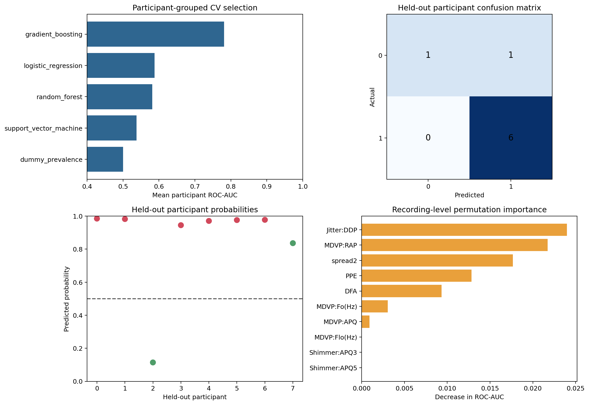

# Participant-Safe Parkinson's Voice Classification

> **Value proposition:** Evaluate voice-based classification without allowing recordings from one participant to cross train/test boundaries.

  

## Executive summary

**Business question.** Evaluate voice-based classification without allowing recordings from one participant to cross train/test boundaries.  
**Dataset.** 195 recordings, 22 acoustic features, and 32 derived participant identifiers.  
**Verified result.** With no participant overlap, the eight-person holdout has balanced accuracy 0.750, sensitivity 1.000, and specificity 0.500; uncertainty is necessarily wide.  
**Decision value.** Judge whether signal warrants external study—not make a clinical decision.  
**Primary limitation.** Educational evaluation only—not a diagnostic, screening, monitoring, or treatment system. The eight-person holdout and absent external validation preclude clinical use.



[Open the executed notebook](notebooks/01_end_to_end_analysis.ipynb) · [Inspect source code](src/analysis.py) · [Inspect metrics](reports/metrics.json) · [Original project](<https://github.com/unit-mole/Parkinson-s_Disease_Detection_using_ML_Techniques>)

## Business problem

The intended user is **A biomedical ML researcher reviewing methodology**. The analysis supports this decision: **Judge whether signal warrants external study—not make a clinical decision.** It does not claim causality or production readiness unless the study design supports that claim.

## Analytical questions and success criteria

1. What data-quality issues materially affect the analysis?
2. Which baseline establishes the minimum useful performance or descriptive reference?
3. Which method is selected under a leakage-safe validation design?
4. How stable, calibrated, or assumption-sensitive is the result?
5. What action is supported, and what action remains outside scope?

Technical success requires a fully executed pipeline, correct split logic, task-appropriate metrics, saved evidence, deterministic seeds where supported, and zero notebook errors. Business success requires an interpretable result that changes a defensible analytical decision without fabricating financial impact.

## Dataset and provenance

195 recordings, 22 acoustic features, and 32 derived participant identifiers.

Matches the UCI Parkinsons voice dataset; participant IDs are derived from the recording-name field.

The exact local files, row counts, data types, missingness, cardinality, and checksums are exposed in the notebook and `reports/tables/*data_quality.csv`. Dataset terms must be reviewed separately from the repository's MIT code license.

## Methodology

Participant-level holdout, StratifiedGroupKFold selection, dummy/logistic/SVM/forest/boosting comparison, recording and participant metrics, bootstrap intervals, false-negative review, and permutation importance.

Reusable logic lives in `src/analysis.py`; the notebook imports and executes that same implementation. Preprocessing is fitted only inside training folds where a supervised model is used. Grouped and chronological projects keep entity and time boundaries intact.

## Validation strategy

```json
{
  "train_participants": 24,
  "held_out_participants": 8,
  "same_participant_in_train_and_test": false,
  "model_selection": "4-fold StratifiedGroupKFold on training participants",
  "random_seed": 42
}
```

## Verified result

> With no participant overlap, the eight-person holdout has balanced accuracy 0.750, sensitivity 1.000, and specificity 0.500; uncertainty is necessarily wide.

### Primary comparison table

| model | participant_cv_roc_auc_mean | participant_cv_roc_auc_std | participant_cv_balanced_accuracy_mean | participant_cv_recall_mean |
|---|---|---|---|---|
| gradient_boosting | 0.781 | 0.138 | 0.600 | 0.950 |
| logistic_regression | 0.588 | 0.421 | 0.575 | 0.775 |
| random_forest | 0.581 | 0.415 | 0.594 | 0.938 |
| support_vector_machine | 0.537 | 0.489 | 0.594 | 0.938 |
| dummy_prevalence | 0.500 | 0.102 | 0.500 | 1.000 |

All values above are generated from the committed data and synchronized with `reports/metrics.json` after execution.

## Explainability, diagnostics, and robustness

- The project saves its comparison and diagnostic tables under `reports/tables/`.
- The primary figure combines model/statistical evidence with error, stability, calibration, or profile evidence appropriate to the task.
- Predictive projects compare against a baseline and preserve an untouched holdout.
- Statistical projects report assumptions, effect size, and robust alternatives.
- Clustering projects report internal metrics as descriptive evidence—not proof of objectively real groups.
- Time-series projects use chronological origins and transparent baselines.

## Business recommendations

| Priority | Recommendation | Evidence | Expected benefit | Risk or limitation | How to measure success |
|---:|---|---|---|---|---|
| 1 | Use the verified result to prioritize a controlled analytical follow-up. | With no participant overlap, the eight-person holdout has balanced accuracy 0.750, sensitivity 1.000, and specificity 0.500; uncertainty is necessarily wide. | Better evidence for the stated decision | Observational or historical data may not generalize | Re-run on current data with a prespecified metric |
| 2 | Review the largest error, uncertainty, or sensitivity segment before deployment. | See saved diagnostic tables | Reduces hidden failure risk | Small subgroups can produce unstable estimates | Track subgroup error and interval coverage |
| 3 | Keep a transparent baseline in future monitoring. | Baseline comparison is recorded in the notebook | Detects when complexity stops adding value | Baselines do not capture every business driver | Compare every refresh against the same baseline |

## Limitations and responsible use

See the executed metrics for project-specific limitations.

Educational evaluation only—not a diagnostic, screening, monitoring, or treatment system. The eight-person holdout and absent external validation preclude clinical use.

## Repository structure

```text
11-parkinsons-disease-detection/
├── data/README.md
├── notebooks/01_end_to_end_analysis.ipynb
├── src/analysis.py
├── reports/figures/
├── reports/tables/
├── reports/metrics.json
├── models/                 # when a fitted artifact is useful
├── PROJECT_SUMMARY.md
└── README.md
```

## Run locally

From the portfolio root:

```bash
python projects/11-parkinsons-disease-detection/src/analysis.py
python scripts/execute_notebooks.py --project 11-parkinsons-disease-detection
python validate_portfolio.py
```

Expected project runtime is hardware-dependent; the root reproducibility report records the measured portfolio run. Outputs are written under `projects/11-parkinsons-disease-detection/reports/` and, for selected predictive models, `projects/11-parkinsons-disease-detection/models/`.

## Technologies and skills demonstrated

Python 3.12/3.13 · pandas · NumPy · SciPy · scikit-learn · Matplotlib · OpenPyXL · Jupyter · data-quality engineering · Grouped high-stakes classification · reproducibility · responsible interpretation.

## Future work

Acquire current, licensed, externally representative data; pre-register the primary metric and validation design; add domain-reviewed cost assumptions; and test the final approach prospectively before any operational use.

## Interview-ready explanation

“I rebuilt this as a grouped high-stakes classification case study. I began with provenance and data-quality risks, defined a baseline and validation design appropriate to the unit of observation, compared only justified methods, and accepted the result shown above even where a simpler baseline won. I then connected diagnostics and uncertainty to a specific stakeholder decision and documented where the evidence must not be used.”

## Résumé bullets

- Re-engineered a biomedical machine learning analysis into a reproducible grouped high-stakes classification workflow with automated data-quality evidence, saved outputs, and a fully executed recruiter-facing notebook.
- Implemented participant-level holdout and problem-appropriate validation to produce the verified result: With no participant overlap, the eight-person holdout has balanced accuracy 0.750, sensitivity 1.000, and specificity 0.500; uncertainty is necessarily wide.
- Translated model/statistical diagnostics into prioritized recommendations while documenting provenance, uncertainty, and responsible-use limits.
