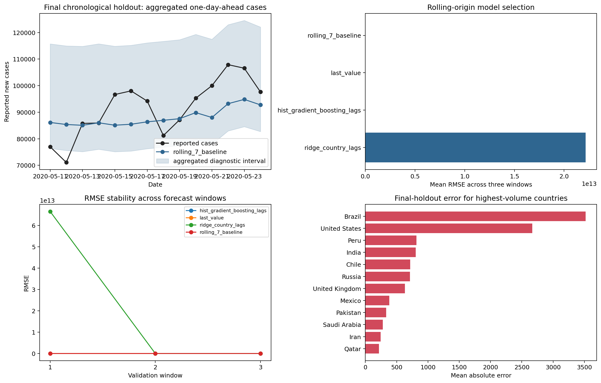

# Historical COVID-19 Next-Day Case Modeling

> **Value proposition:** Compare lag-only one-day-ahead models with transparent baselines across multiple chronological windows.

  

## Executive summary

**Business question.** Compare lag-only one-day-ahead models with transparent baselines across multiple chronological windows.  
**Dataset.** 19,496 country-date rows from December 2019 through May 2020 with cases, tests, policy, population, and demographic fields.  
**Verified result.** Across rolling origins, the seven-day rolling baseline remains best; final historical holdout RMSE is 388.2 with 89.6% diagnostic interval coverage.  
**Decision value.** Assess baseline adequacy and reporting risk—not make a current forecast or policy recommendation.  
**Primary limitation.** Historical educational analysis only. Early-pandemic reporting revisions, testing changes, policy shifts, and short coverage make it unsuitable for current forecasting, policy, or medical decisions.



[Open the executed notebook](notebooks/01_end_to_end_analysis.ipynb) · [Inspect source code](src/analysis.py) · [Inspect metrics](reports/metrics.json) · [Original project](<https://github.com/unit-mole/Covid-19-outbreak-prediction>)

## Business problem

The intended user is **A public-health data scientist reviewing historical methods**. The analysis supports this decision: **Assess baseline adequacy and reporting risk—not make a current forecast or policy recommendation.** It does not claim causality or production readiness unless the study design supports that claim.

## Analytical questions and success criteria

1. What data-quality issues materially affect the analysis?
2. Which baseline establishes the minimum useful performance or descriptive reference?
3. Which method is selected under a leakage-safe validation design?
4. How stable, calibrated, or assumption-sensitive is the result?
5. What action is supported, and what action remains outside scope?

Technical success requires a fully executed pipeline, correct split logic, task-appropriate metrics, saved evidence, deterministic seeds where supported, and zero notebook errors. Business success requires an interpretable result that changes a defensible analytical decision without fabricating financial impact.

## Dataset and provenance

19,496 country-date rows from December 2019 through May 2020 with cases, tests, policy, population, and demographic fields.

Schema and period align with an early Our World in Data snapshot; exact snapshot checksum and redistribution history were not recorded in the original repository.

The exact local files, row counts, data types, missingness, cardinality, and checksums are exposed in the notebook and `reports/tables/*data_quality.csv`. Dataset terms must be reviewed separately from the repository's MIT code license.

## Methodology

Revision audit, lag/rolling features, three 14-day rolling origins, last-value and rolling baselines, country-aware ridge, histogram boosting, final chronological holdout, diagnostic intervals, and country-level error analysis.

Reusable logic lives in `src/analysis.py`; the notebook imports and executes that same implementation. Preprocessing is fitted only inside training folds where a supervised model is used. Grouped and chronological projects keep entity and time boundaries intact.

## Validation strategy

```json
{
  "selection": "three rolling-origin 14-day windows",
  "final_holdout_start": "2020-05-11",
  "final_holdout_end": "2020-05-24",
  "final_train_rows": 14890,
  "final_test_rows": 2917,
  "random_seed": 42
}
```

## Verified result

> Across rolling origins, the seven-day rolling baseline remains best; final historical holdout RMSE is 388.2 with 89.6% diagnostic interval coverage.

### Primary comparison table

| model | mean_rmse | std_rmse | mean_mae | mean_r_squared |
|---|---|---|---|---|
| rolling_7_baseline | 499.850 | 87.223 | 89.887 | 0.947 |
| last_value | 570.842 | 177.555 | 88.214 | 0.926 |
| hist_gradient_boosting_lags | 935.403 | 497.092 | 125.046 | 0.788 |
| ridge_country_lags | 22177568938844.570 | 38412675098825.969 | 663354371151.761 | -293419392032395558912.000 |

All values above are generated from the committed data and synchronized with `reports/metrics.json` after execution.

## Explainability, diagnostics, and robustness

- The project saves its comparison and diagnostic tables under `reports/tables/`.
- The primary figure combines model/statistical evidence with error, stability, calibration, or profile evidence appropriate to the task.
- Predictive projects compare against a baseline and preserve an untouched holdout.
- Statistical projects report assumptions, effect size, and robust alternatives.
- Clustering projects report internal metrics as descriptive evidence—not proof of objectively real groups.
- Time-series projects use chronological origins and transparent baselines.

## Business recommendations

| Priority | Recommendation | Evidence | Expected benefit | Risk or limitation | How to measure success |
|---:|---|---|---|---|---|
| 1 | Use the verified result to prioritize a controlled analytical follow-up. | Across rolling origins, the seven-day rolling baseline remains best; final historical holdout RMSE is 388.2 with 89.6% diagnostic interval coverage. | Better evidence for the stated decision | Observational or historical data may not generalize | Re-run on current data with a prespecified metric |
| 2 | Review the largest error, uncertainty, or sensitivity segment before deployment. | See saved diagnostic tables | Reduces hidden failure risk | Small subgroups can produce unstable estimates | Track subgroup error and interval coverage |
| 3 | Keep a transparent baseline in future monitoring. | Baseline comparison is recorded in the notebook | Detects when complexity stops adding value | Baselines do not capture every business driver | Compare every refresh against the same baseline |

## Limitations and responsible use

See the executed metrics for project-specific limitations.

Historical educational analysis only. Early-pandemic reporting revisions, testing changes, policy shifts, and short coverage make it unsuitable for current forecasting, policy, or medical decisions.

## Repository structure

```text
13-covid-outbreak-prediction/
├── data/README.md
├── notebooks/01_end_to_end_analysis.ipynb
├── src/analysis.py
├── reports/figures/
├── reports/tables/
├── reports/metrics.json
├── models/                 # when a fitted artifact is useful
├── PROJECT_SUMMARY.md
└── README.md
```

## Run locally

From the portfolio root:

```bash
python projects/13-covid-outbreak-prediction/src/analysis.py
python scripts/execute_notebooks.py --project 13-covid-outbreak-prediction
python validate_portfolio.py
```

Expected project runtime is hardware-dependent; the root reproducibility report records the measured portfolio run. Outputs are written under `projects/13-covid-outbreak-prediction/reports/` and, for selected predictive models, `projects/13-covid-outbreak-prediction/models/`.

## Technologies and skills demonstrated

Python 3.12/3.13 · pandas · NumPy · SciPy · scikit-learn · Matplotlib · OpenPyXL · Jupyter · data-quality engineering · Historical panel forecasting · reproducibility · responsible interpretation.

## Future work

Acquire current, licensed, externally representative data; pre-register the primary metric and validation design; add domain-reviewed cost assumptions; and test the final approach prospectively before any operational use.

## Interview-ready explanation

“I rebuilt this as a historical panel forecasting case study. I began with provenance and data-quality risks, defined a baseline and validation design appropriate to the unit of observation, compared only justified methods, and accepted the result shown above even where a simpler baseline won. I then connected diagnostics and uncertainty to a specific stakeholder decision and documented where the evidence must not be used.”

## Résumé bullets

- Re-engineered a public-health time series analysis into a reproducible historical panel forecasting workflow with automated data-quality evidence, saved outputs, and a fully executed recruiter-facing notebook.
- Implemented revision audit and problem-appropriate validation to produce the verified result: Across rolling origins, the seven-day rolling baseline remains best; final historical holdout RMSE is 388.2 with 89.6% diagnostic interval coverage.
- Translated model/statistical diagnostics into prioritized recommendations while documenting provenance, uncertainty, and responsible-use limits.
